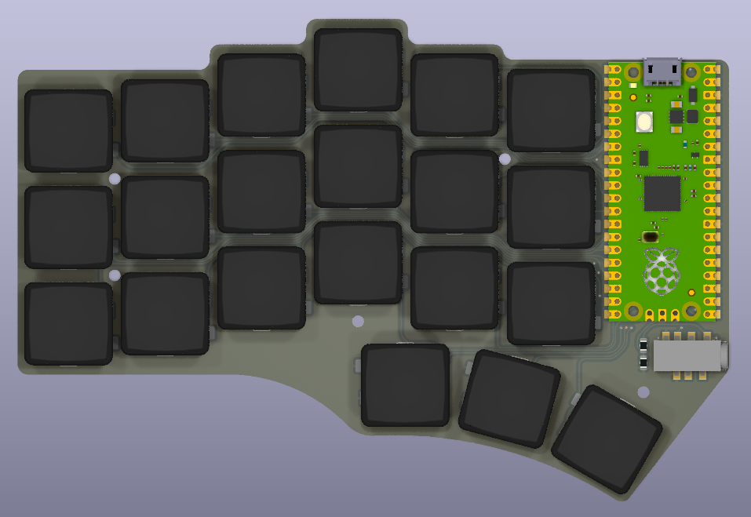
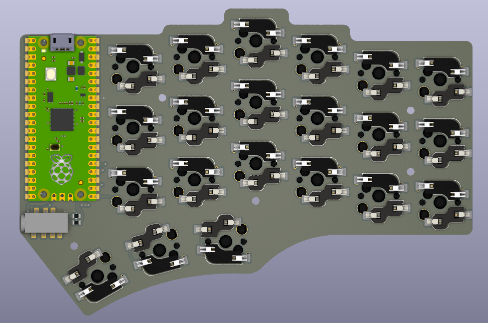
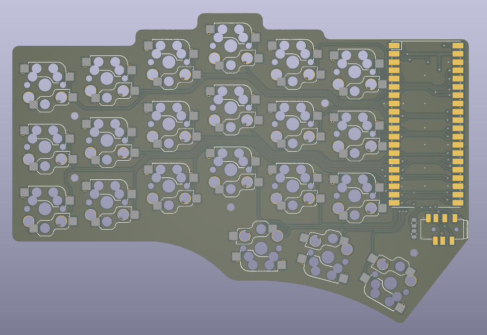
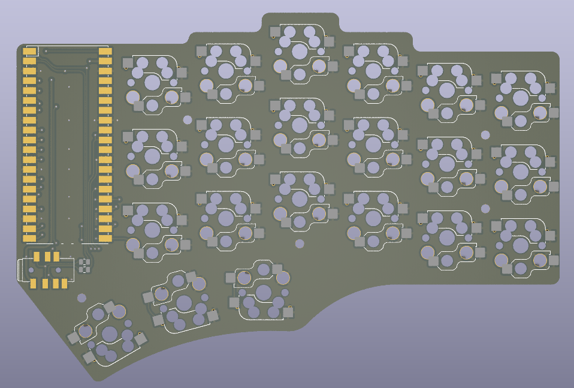

The Unnamed Keyboard is a 42-key, diodeless, flippable, low profile choc v1 or MX 3 pin switch hotswap, IO protected, aggressive column staggered, programmable ergonomic mechnical split keyboard powered by Rasyberry Pi Pico or other compatible RP2040 boards. It is based on the [Piantor](https://github.com/beekeeb/piantor) Keyboard. 
## Features

* Powered by RP2040 MCU with Raspberry Pi Pico
* Cantor & Corne like layout
* Flippable layout
* Diodeless
* Split hand pin for automatically left hand detection, single firmware for both sides
* TRRS with resistor protection, hot-plug no damage 
* Hybrid hotswap: low profile choc switches and MX switches(3pin)

## BOM
* Raspberry Pi Pico (or compatible one) * 2
* choc swtiches / MX(3pin) switches * 42
* hotswap sockets for choc swtiches / MX(3pin) switches * 42
* TRRS sockets * 2, C128990(JLC)
* 3.5mm TRRS wire (4 pin)
* 100r 0805 resistor * 4 (for io protection)
* 1k 0805 resistor *  2 (for hand pin detection)

## Images
top left

bottom left(ignore the TRRS connector and pico:)

pcb top

pcb bottom

first made 

